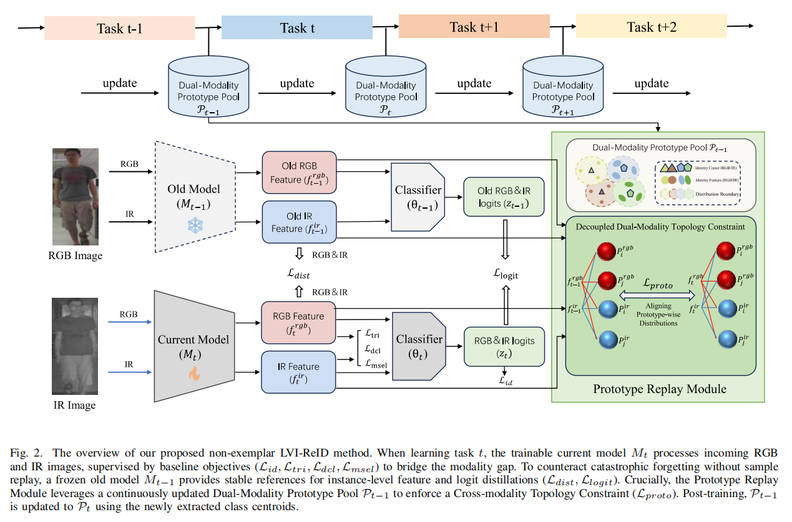
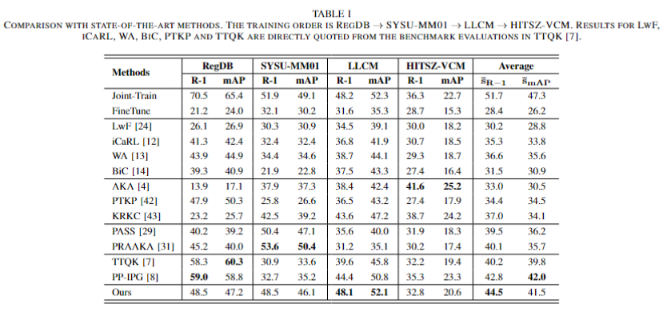

## Decoupled Modality Prototyping for Non-exemplar Lifelong Visible-Infrared Person Re-identification


### 1. Prepare datasets

1. RegDB can be downloaded at this [website](http://dm.dongguk.edu/link.html)
2. SYSU-MM01 is released at this link. [SYSU-MM01](https://github.com/wuancong/SYSU-MM01)
3. LLCM is released at this link. [LLCM](https://github.com/ZYK100/LLCM)
4. HITSZ-VCM is released this link. [HITSZ-VCM](https://github.com/VCM-project233/HITSZ-VCM-data)

You need run ```python pre_process_sysu.py```before training. 

### 2. Data sturture:

Please prepare the datasets in below structure:
```angular2html
data_path/
├── RegDB/
│   ├── idx/
│   ├── Thermal/
│   └── Visible/
├── SYSU-MM01/
│   ├── ori_data/
│   ├── train_ir_resized_img.npy
│   ├── train_ir_resized_label.npy
│   ├── train_rgb_resized_img.npy
│   └── train_rgb_resized_label.npy
├── LLCM/
│   ├── idx/
│   ├── nir/
│   ├── test_nir/
│   ├── test_vis/
│   └── vis/
├── HITSZ-VCM/
│   ├── info/
│   ├── Test/
│   └── Train/
```

### 3. Quick Start


Training + evaluation:
```shell
python continual_train.py --data_dir '/your/path/data'`
```

**Notice:**
1. You may also need modify the data path in `Class VCM` according to yours in `data_manager.py`(line 170).

2. The logs will be saved in `./logs/` and model will be saved in `./save_model/`

3. You may need to download the ImageNet pretrained transformer model [ViT-Base](https://github.com/rwightman/pytorch-image-models/releases/download/v0.1-vitjx/jx_vit_base_p16_224-80ecf9dd.pth) and ajust the PRETRAIN_PATH in `./config/config.py`.




### Acknowledgements

Most of the code are based on [TTQK](https://github.com/SWU-CS-MediaLab/TTQK) and [PMT](https://github.com/hulu88/PMT).
